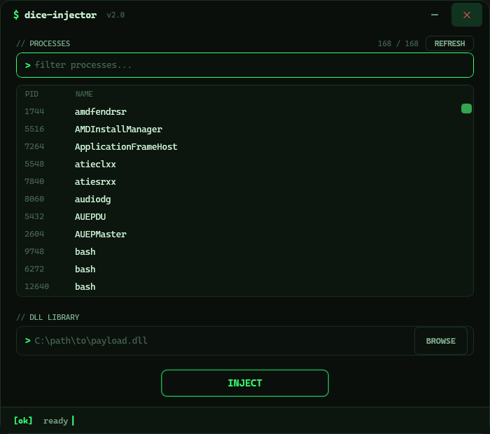

<div align="center">


# DICE INJECTOR

### Современный GUI-инжектор DLL с интерфейсом в стиле зелёного терминала

*Инструмент для тех, кто хочет понять, как работает Windows-процесс, руками, а не по документации*

[](https://dotnet.microsoft.com/)
[]()
[](LICENSE)
[]()

</div>

---

> ⚠️ **Правовая оговорка.** Инструмент предназначен исключительно для работы
> с процессами и приложениями, которыми вы владеете, или системами, на
> тестирование которых у вас есть явное письменное разрешение владельца —
> собственный проект, отладка своих программ, учебный стенд, исследования.
> Инъекция в чужие процессы (обход защиты игр и античитов, вредоносное ПО)
> нарушает условия использования и может преследоваться по закону. Авторы
> проекта не несут ответственности за неправомерное использование.

---

## О проекте

DICE INJECTOR — GUI-инжектор DLL, который показывает классическую технику
загрузки библиотеки в чужой процесс через `CreateRemoteThread` +
`LoadLibraryW` в удобном и наглядном интерфейсе.

Проект состоит из двух версий интерфейса.

**InjectorWPF (основная)** — интерфейс в стиле тёмного зелёного терминала:
моноширинный шрифт, мигающий курсор, инверсия выбора как в настоящем
терминале, окно без системного заголовка со скруглёнными углами. Инжект
выполняется в фоне, интерфейс не зависает.

**Injector (оригинальная)** — та же логика на чистом Win32 + GDI+ без
сторонних библиотек: кастомная отрисовка каждого элемента, двойная
буферизация, собственная тема.

Обе версии пригодны для изучения: логика инжекта короткая и читаемая,
ошибки Win32 API не проглатываются, а выводятся в статусную строку.

<p align="center">
  
</p>

---

## Возможности

### Интерфейс (InjectorWPF)

- Тёмная зелёная терминальная тема: `$ dice-injector v2.0` в шапке,
  секции в стиле комментариев кода (`// PROCESSES`, `// DLL LIBRARY`).
- Моноширинный шрифт везде: Cascadia Mono → Consolas → Courier New.
- Окно без системного заголовка: скруглённые углы, тень, перетаскивание
  за шапку, свои кнопки свернуть/закрыть.
- Мигающий терминальный курсор в шапке и в статусной строке.
- Плавные ховеры: зелёное свечение кнопки INJECT, подсветка полей ввода
  при фокусе (рамка загорается зелёным).

### Список процессов

- Колонки PID и NAME, выравнивание как в терминале.
- Выбор строки — «инверсия»: зелёная заливка, тёмный текст.
- Поиск с фильтрацией в реальном времени и плейсхолдером `filter processes...`.
- Кнопка REFRESH и счётчик `найдено / всего`.
- Двойной клик по строке запускает инжект.

### Инжект

- Классическая техника: `OpenProcess` → `VirtualAllocEx` →
  `WriteProcessMemory` → `CreateRemoteThread(LoadLibraryW)`.
- Выполняется в фоновом потоке — интерфейс остаётся отзывчивым, кнопка
  показывает `INJECTING...`.
- Диагностика: код ошибки Win32 на каждом шаге, проверка результата
  `LoadLibrary` внутри целевого процесса.
- Путь к DLL: через диалог BROWSE или вручную, Enter запускает инжект.

### Версии

| Версия | Стек | Интерфейс |
|--------|------|-----------|
| `InjectorWPF` | C# / .NET 10 / WPF | Зелёный терминал (рекомендуется) |
| `Injector` | C++ / Win32 + GDI+ | Кастомная тёмная отрисовка |

---

## Быстрый старт

Нужен [.NET 10 SDK](https://dotnet.microsoft.com/download) для WPF-версии
и Visual Studio 2022 (C++ desktop workload) для C++-версии.

```bat
cd InjectorWPF
dotnet build -c Release
.\bin\Release\net10.0-windows\DiceInjector.exe
```

Self-contained EXE (запуск без установленного .NET):

```bat
cd InjectorWPF
dotnet publish -c Release -r win-x64 --self-contained true
```

C++-версия — откройте `Injector\Injector.sln` в Visual Studio и соберите
Release x64, либо:

```bat
msbuild Injector\Injector.vcxproj /p:Configuration=Release /p:Platform=x64
```

Иконку приложения можно перегенерировать:

```bat
powershell -File Injector\make_icon.ps1
```

---

## Состав проекта

| Файл | Назначение |
|------|-----------|
| `InjectorWPF/MainWindow.xaml` | Разметка окна (терминальная тема) |
| `InjectorWPF/Theme/TerminalTheme.xaml` | Цвета, шрифты, стили кнопок, списка, скроллбара |
| `InjectorWPF/MainWindow.xaml.cs` | Логика: список, фильтр, статусы, инжект |
| `InjectorWPF/Injection.cs` | P/Invoke инжекта (Win32 API) |
| `InjectorWPF/ProcessItem.cs` | Модель процесса (PID + имя) |
| `Injector/main.cpp` | Оригинальная версия: Win32 + GDI+ одним файлом |
| `Injector/Injector.sln` / `.vcxproj` | Проект Visual Studio |
| `Injector/app.rc`, `icon.ico` | Ресурсы и иконка |
| `Injector/make_icon.ps1` | Генератор иконки (кубик) |
| `README.md` | Документация |
| `LICENSE` | MIT |

---

## Ограничения

DICE INJECTOR — учебный инструмент, а не «универсальный загрузчик». Сделан
намеренно простым, чтобы технику можно было понять с одного прочтения.

Что он **не** делает:

- Инжектирует только DLL той же архитектуры (x64 DLL → x64 процесс).
- Не обходит защиту античитов и антивирусов (и не должен — см. оговорку).
- Не работает с процессами, к которым нет доступа (некоторые системные
  процессы требуют прав администратора).
- Не использует продвинутые техники (manual mapping, APC, process hollowing) —
  только классический LoadLibrary.

Для серьёзного изучения Windows-инжекции дополнительно посмотрите:

- **MinHook / Detours** — перехват API.
- **Process Hacker** — как устроены «загрузчики» изнутри.
- Официальную документацию по [Win32 API](https://learn.microsoft.com/windows/win32/api/).

---

## Лицензия и участие

[MIT](LICENSE) — делай что хочешь, оставь копирайт.

Баги, идеи, новые версии интерфейса — через Issues и Pull Requests.
